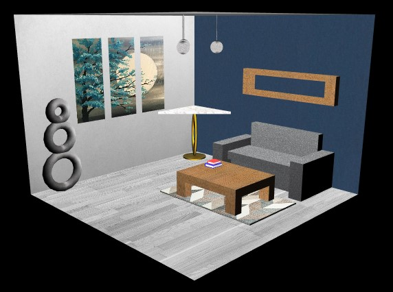

# LAIG 2020/2021

## Group T01G08

| Name             | Number    | E-Mail             |
| ---------------- | --------- | ------------------ |
| Mariana Truta    | 201806543 |up201806543@fe.up.pt|
| Ricardo Nunes    | 201706860 |up201706860@fe.up.pt|

----

## Projects

### [TP1 - Scene Graph](TP1)

- To convert a .XML file into a WebGl scene, it was created a parser to read all the information and display all the described components.
- Our scene is a living room:

- Grade: 18.8

----

### [TP2 - Animations, Spritesheets and NURBS](TP2)

- Animations, spritesheets and NURBS were implemented and added to the first project.
- The scene has some extra objects to demonstrate the new features.

- Grade: 19.2

----

### [TP3 - Greener](TP3)

- 3D environment developed in WebGL to represent the game states of a Prolog board game, Greener.
- Read the [user manual](TP3/resources/User_Manual.pdf) to understand how to play.

- Grade: 18.7
