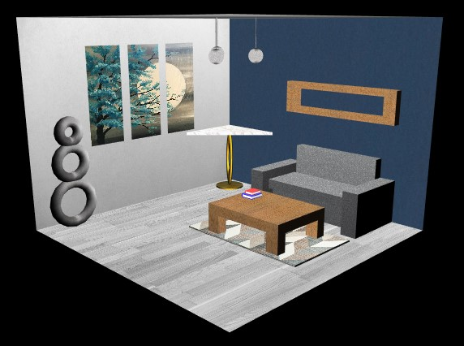

# LAIG 2020/2021 - TP1

## Group T01G08

| Name             | Number    | E-Mail             |
| ---------------- | --------- | ------------------ |
| Mariana Truta    | 201806543 |up201806543@fe.up.pt|
| Ricardo Nunes    | 201706860 |up201706860@fe.up.pt|

----

## Project information

- To increase the efficiency of the program, **Maps** where used to store the components of the XML (except lights which were stored in an **array**).
- **Warnings** are sent when there are **minor errors** on the XML file. However, the program **stops** if the error makes it **impossible** to render the scene.
- Default camera, light and material are applied when none is defined.
- Scene:
  - The scene is a living room, with a sofa and two tables. On top of one table, there are two books: one red and one blue. At the corner of the room, an art piece resides. Behind the sofa, there is a wooden shelf. To decorate the room, it was added a carpet and a painting. Iluminating the room, there are three chandeliers.
  - Click [here](./scenes/LAIG_TP1_T1_G08.xml) to access the XML file.

----

## Issues/Problems

- No known bugs or errors
