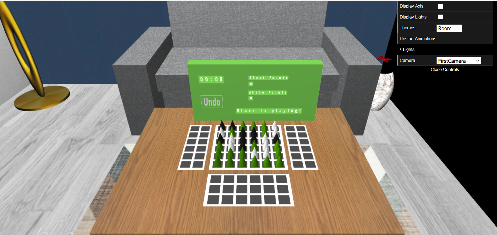

# LAIG 2020/2021 - TP3

## Group T01G08

| Name             | Number    | E-Mail             |
| ---------------- | --------- | ------------------ |
| Mariana Truta    | 201806543 |up201806543@fe.up.pt|
| Ricardo Nunes    | 201706860 |up201706860@fe.up.pt|

----

## Project information

- To increase the efficiency of the program, **Maps** where used to store the components of the XML (except lights which were stored in an **array**).
- **Warnings** are sent when there are **minor errors** on the XML file. However, the program **stops** if the error makes it **impossible** to render the scene.
- Default camera, light and material are applied when none is defined.
  
- There are 3 themes: Simple, Living Room and Picnic.

- The user can choose the theme, level of AI and board size in the interface board.

- The animations of the pieces are curve.

[User Manual](./resources/User_Manual.pdf) [Greener Rules](https://boardgamegeek.com/boardgame/226081/greener)

----

Simple Theme 
Room Theme 
Picnic Theme 
